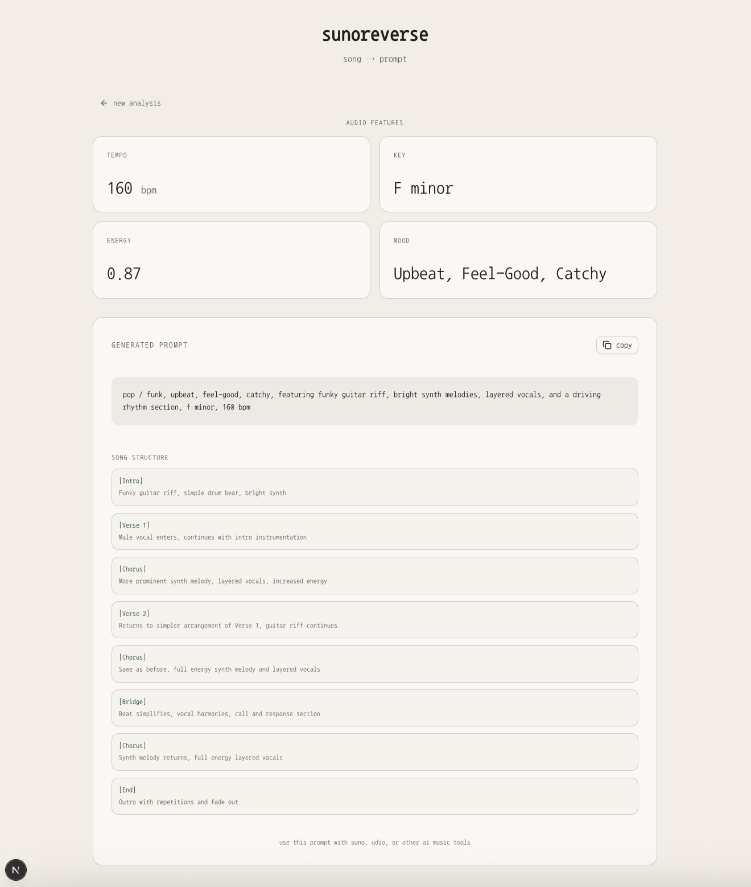

# sunoreverse

reverse engineer any song into a suno ai prompt

## what is this?

upload an audio file, get a detailed prompt for suno ai. it analyzes the music using librosa (tempo, key, energy) and google gemini (genre, mood, instrumentation, song structure). perfect for recreating vibes or learning how to describe music better.

## why?

writing good prompts for ai music generators is hard. this tool does it automatically by analyzing existing songs you like.

## demo

<br/>
home page: drag and drop any song


get a detailed prompt + song analysis


## how it works

1. **upload** - drop an mp3, wav, or flac file
2. **analyze** - backend extracts musical features + gemini interprets creative elements
3. **copy** - get a suno-ready prompt with accurate bpm/key + creative description

## features

- musical analysis: tempo, key detection, energy levels
- ai interpretation: genre, mood, instrumentation, vocal style
- temporal analysis: section-by-section breakdown ([intro], [verse], [chorus])
- three prompt versions: simple (v1), suno-optimized (v2), detailed sections (v3)
- real-time processing with error handling

## tech stack

**backend:**
- fastapi (python)
- librosa (audio analysis)
- google gemini api (ai interpretation)
- uvicorn (asgi server)

**frontend:**
- next.js (react)
- shadcn/ui (components)
- tailwind css (styling)
- typescript

## setup

### prerequisites
- python 3.10+
- node.js 18+
- google gemini api key ([get one here](https://ai.google.dev/))

### backend

```bash
# create virtual environment
python3.10 -m venv venv
source venv/bin/activate  # or `venv\Scripts\activate` on windows

# install dependencies
pip install -r requirements.txt

# set up environment variables
cp .env.example .env
# add your GEMINI_API_KEY to .env

# run server
uvicorn backend.main:app --reload --port 8000
```

### frontend

```bash
cd frontend

# install dependencies
npm install

# set up environment variables
cp .env.example .env.local
# NEXT_PUBLIC_API_URL should be http://localhost:8000

# run dev server
npm run dev
```

visit `http://localhost:3000`

## prompt versions

switch between prompt styles by editing `.env`:

```env
PROMPT_VERSION=v1  # simple, general prompts
PROMPT_VERSION=v2  # suno tag bank optimized
PROMPT_VERSION=v3  # section-by-section analysis
```

see `backend/prompts/README.md` for details on each version.

## project structure

```
audiomood/
├── backend/
│   ├── main.py              # fastapi app
│   ├── features.py          # librosa audio analysis
│   ├── audio_llm.py         # gemini api integration
│   └── prompts/             # prompt templates (v1, v2, v3)
├── frontend/
│   ├── app/                 # next.js pages
│   ├── components/          # react components
│   └── lib/                 # api client, validation
├── docs/                    # documentation
└── tests/                   # test scripts
```

## example output

**audio features:**
- tempo: 110 bpm
- key: g# minor
- energy: 0.91
- mood: dark, brooding

**generated prompt:**
```
grunge / alternative rock, dark, brooding, desperate, featuring heavy
distorted guitars, powerful drums, screamed vocals, raw emotion, intense
energy, g# minor, 110 bpm
```

**song structure (v3):**
- [intro] - heavy distorted guitars, feedback, distorted vocal intro
- [verse 1] - heavy distorted guitars continue, drums enter, raspy male vocals
- [chorus] - more intense guitars, louder drums, screamed vocals, desperate mood
- [bridge] - tempo slows, cleaner guitar tone, vocals more subdued
- [outro] - guitar feedback, drums fade out, lingering distorted sound

## contributing

this is a personal project, but feel free to fork and adapt for your own use.

## license

mit

## acknowledgments

- [suno ai](https://suno.com) for the inspiration
- [librosa](https://librosa.org) for music analysis
- [google gemini](https://ai.google.dev) for multimodal ai
- reddit's r/sunoAI community for prompt engineering insights
